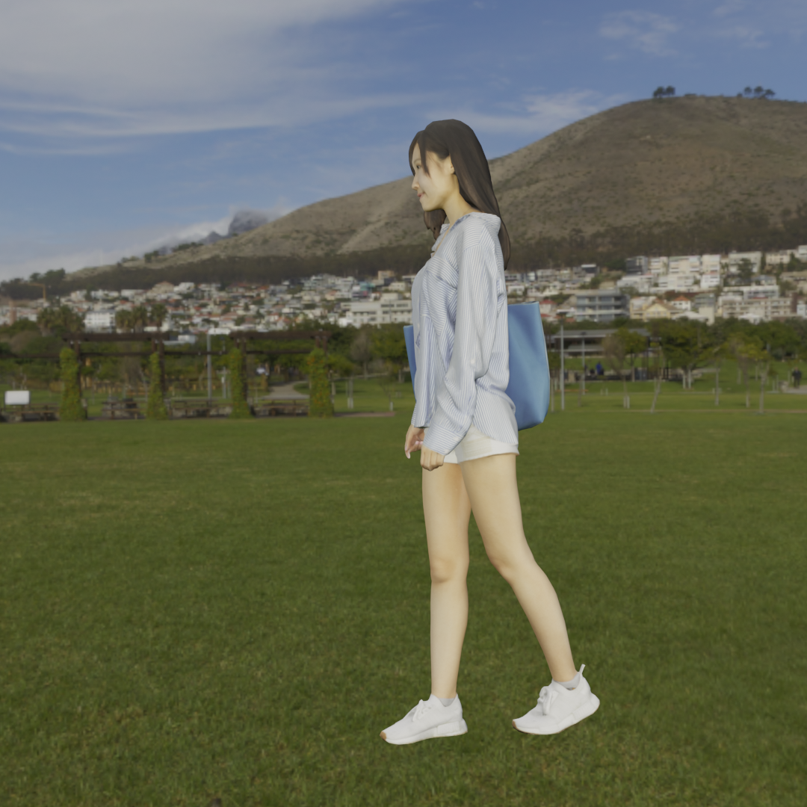

# HigherHRNet in Multi-View Envionment

This is a sample implementation for pose estimation in 3D with HigherHRNet on multi-view environment. Multi-view triangulation is adopted.

## How it works

Suppose we have images of a human and calibration data for each cameras (sample images and calibration data are stored in `sample/images` and `sample/calibrations`). HigherHRNet estimates human pose in 2D for each images, and then evaluate human pose in 3D with multi-view triangulation.

For simple implementation, [stefanopini/simple-HigherHRNet](https://github.com/stefanopini/simple-HigherHRNet) is used for HigherHRNet. Multi-view triangulation is implemented based on [this article (in Japanese)](https://mem-archive.com/2018/11/04/post-867/), and [scipy.linalg.svd](https://docs.scipy.org/doc/scipy/reference/generated/scipy.linalg.svd.html) is used for solving singular value decomposition.

## Installation

### Install simple-HigherHRNet

[stefanopini/simple-HigherHRNet](https://github.com/stefanopini/simple-HigherHRNet) is included in this git repository as a submodule. Follow the steps of README.md of simple-HigherHRNet to install it.

### Download pretrained model

simple-HigherHRNet fully supports the original HigherHRNet's pretrained model, so download them from the official model zoo of HigherHRNet (the url may change in the future, so please check [the official HigherHRNet README.md](https://github.com/HRNet/HigherHRNet-Human-Pose-Estimation)).

- [GoogleDrive](https://drive.google.com/open?id=1bdXVmYrSynPLSk5lptvgyQ8fhziobD50)
- [OneDrive](https://1drv.ms/f/s!AhIXJn_J-blW4AwKRMklXVzndJT0)

After downloading, place them in `checkpoints/`.

### Install scipy

Simply install scipy. You can also install with using [requirements.txt](./requirements.txt).

## Run sample script

[estimate-pose3d.py](./estimate-pose3d.py) is the sample script to estimate pose in 3D. Run as follow:

```
python ./estimate-pose3d.py
```

### As for the sample data ...

The sample data in `sample/` is from [ynyBonfennil/Blender-Camera-Calibration](https://github.com/ynyBonfennil/Blender-Camera-Calibration).

As you can see, the images are not taken in a real environment but in virtual environment (blender). But it seems HigherHRNet works without any problems, and what is better, it is easier to check the 3D keypoint estimation result because you can use a cursor in blender.


